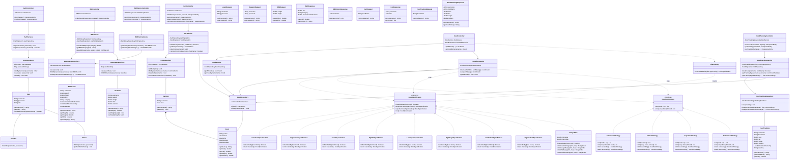

# UML Class Diagram - Complete System

```mermaid
classDiagram
    %% ========== MODELS ==========
    class User {
        -String username
        -String password
        -String role
        +getUsername() String
        +getRole() String
        +checkPassword(inputPassword) boolean
    }

    class Member {
        +Member(username, password)
    }

    class Admin {
        +Admin(username, password)
        +performAdminTasks() void
    }

    class Food {
        -String name
        -double kcal
        -double fat
        -double sugar
        -double sodium
        +getName() String
        +getKcal() double
        +getFat() double
        +getSugar() double
        +getSodium() double
    }

    class CartItem {
        -String username
        -Food food
        +getUsername() String
        +getFood() Food
    }

    class BMIRecord {
        -String username
        -double weight
        -double height
        -double bmi
        -String category
        -double recommendedCalories
        -LocalDateTime timestamp
        -LocalDate date
        +getUsername() String
        +getWeight() double
        +getHeight() double
        +getBmi() double
        +getCategory() String
    }

    class FoodTracking {
        -String username
        -String foodName
        -double kcal
        -double fat
        -double sugar
        -double sodium
        -LocalDateTime timestamp
        -String dateKey
        +getUsername() String
        +getFoodName() String
        +getKcal() double
    }

    class UserData {
        -String username
        -double weight
        -double height
        -double bmi
        -double calories
        +getUsername() String
        +getWeight() double
        +setWeight(weight) void
        +setHeight(height) void
    }

    %% ========== INTERFACES ==========
    class FoodSpecification {
        <<interface>>
        +isSatisfiedBy(food Food) boolean
        +and(other FoodSpecification) FoodSpecification
        +or(other FoodSpecification) FoodSpecification
        +not() FoodSpecification
    }

    class FoodSortStrategy {
        <<interface>>
        +sort(foods List) List
        +compare(a Food, b Food) int
    }

    %% ========== FILTERING IMPLEMENTATIONS ==========
    class LowCalorieSpecification {
        +isSatisfiedBy(food Food) boolean
        +static standard() FoodSpecification
    }

    class HighCalorieSpecification {
        +isSatisfiedBy(food Food) boolean
        +static standard() FoodSpecification
    }

    class LowFatSpecification {
        +isSatisfiedBy(food Food) boolean
        +static standard() FoodSpecification
    }

    class HighFatSpecification {
        +isSatisfiedBy(food Food) boolean
        +static standard() FoodSpecification
    }

    class LowSugarSpecification {
        +isSatisfiedBy(food Food) boolean
        +static standard() FoodSpecification
    }

    class HighSugarSpecification {
        +isSatisfiedBy(food Food) boolean
        +static standard() FoodSpecification
    }

    class LowSodiumSpecification {
        +isSatisfiedBy(food Food) boolean
        +static standard() FoodSpecification
    }

    class HighSodiumSpecification {
        +isSatisfiedBy(food Food) boolean
        +static standard() FoodSpecification
    }

    class RangeFilter {
        -double minValue
        -double maxValue
        +isSatisfiedBy(food Food) boolean
        +static calorieRange(min, max) RangeFilter
        +static sugarRange(min, max) RangeFilter
        +static fatRange(min, max) RangeFilter
        +static sodiumRange(min, max) RangeFilter
    }

    %% ========== SORTING IMPLEMENTATIONS ==========
    class CalorieSortStrategy {
        +sort(foods List) List
        +compare(a Food, b Food) int
        +static ascending() FoodSortStrategy
        +static descending() FoodSortStrategy
    }

    class FatSortStrategy {
        +sort(foods List) List
        +compare(a Food, b Food) int
        +static ascending() FoodSortStrategy
        +static descending() FoodSortStrategy
    }

    class SugarSortStrategy {
        +sort(foods List) List
        +compare(a Food, b Food) int
        +static ascending() FoodSortStrategy
        +static descending() FoodSortStrategy
    }

    class SodiumSortStrategy {
        +sort(foods List) List
        +compare(a Food, b Food) int
        +static ascending() FoodSortStrategy
        +static descending() FoodSortStrategy
    }

    %% ========== FACTORY ==========
    class FilterFactory {
        +static createFilter(filterType String) FoodSpecification
    }

    %% ========== REPOSITORIES ==========
    class UserRepository {
        -List~User~ userDatabase
        -Map passwordStorage
        +findByUsername(username) User
        +save(user, password) void
        +findAll() List~User~
    }

    class FoodRepository {
        -List~Food~ foodDatabase
        +findAll() List~Food~
        +findByName(name) Food
    }

    class CartRepository {
        -List~CartItem~ cartDatabase
        +addItem(item) void
        +findByUsername(username) List~CartItem~
        +clearCart(username) void
        +removeItem(username, foodName) void
    }

    class BMIHistoryRepository {
        -List~BMIRecord~ bmiDatabase
        +save(record) void
        +findByUsername(username) List~BMIRecord~
        +findByUsernameAndDateRange(...) List~BMIRecord~
    }

    class FoodTrackingRepository {
        -List~FoodTracking~ trackingDatabase
        +save(tracking) void
        +findByUsername(username) List~FoodTracking~
        +findByUsernameAndDateRange(...) List~FoodTracking~
    }

    class UserDataRepository {
        -Map userDataMap
        +save(userData) void
        +findByUsername(username) UserData
    }

    %% ========== SERVICES ==========
    class AuthService {
        -UserRepository userRepository
        +login(username, password) User
        +register(username, password) boolean
    }

    class FoodService {
        -FoodRepository foodRepository
        +getAllFoods() List~Food~
        +getFoodByName(name) Food
    }

    class FoodFilterService {
        -FoodRepository foodRepository
        +filterAndSort(filter, sortStrategy) List~Food~
        +sort(sortStrategy) List~Food~
        +getAllFoods() List~Food~
    }

    class CartService {
        -CartRepository cartRepository
        -FoodRepository foodRepository
        +addToCart(username, foodName) boolean
        +getCart(username) List~CartItem~
        +clearCart(username) void
        +removeFromCart(username, foodName) boolean
    }

    class BMIService {
        -BMIHistoryRepository bmiRepository
        -UserDataRepository userDataRepository
        +calculateBMI(weight, height) double
        +getBMICategory(bmi) String
        +saveBMI(username, weight, height) BMIRecord
    }

    class BMIHistoryService {
        -BMIHistoryRepository bmiRepository
        +getHistoryByUsername(username) List~BMIRecord~
        +getHistoryByDateRange(...) List~BMIRecord~
    }

    class FoodTrackingService {
        -FoodTrackingRepository trackingRepository
        -FoodRepository foodRepository
        +trackFood(username, foodName) boolean
        +getTrackingByUsername(username) List~FoodTracking~
        +getTrackingByDateRange(...) List~FoodTracking~
    }

    %% ========== CONTROLLERS ==========
    class AuthController {
        -AuthService authService
        +login(request) ResponseEntity
        +register(request) ResponseEntity
    }

    class FoodController {
        -FoodService foodService
        -FoodFilterService foodFilterService
        +getAllFoods(...) List~Food~
        +getFoodByName(name) Object
    }

    class CartController {
        -CartService cartService
        +addToCart(username, request) ResponseEntity
        +getCart(username) ResponseEntity
        +clearCart(username) ResponseEntity
        +removeFromCart(username, foodName) ResponseEntity
    }

    class BMIController {
        -BMIService bmiService
        +calculateBMI(username, request) ResponseEntity
    }

    class BMIHistoryController {
        -BMIHistoryService bmiHistoryService
        +getHistory(username) ResponseEntity
        +getHistoryByRange(...) ResponseEntity
    }

    class FoodTrackingController {
        -FoodTrackingService trackingService
        +trackFood(username, request) ResponseEntity
        +getTracking(username) ResponseEntity
        +getTrackingByRange(...) ResponseEntity
    }

    %% ========== DTOs ==========
    class LoginRequest {
        -String username
        -String password
        +getUsername() String
        +getPassword() String
    }

    class RegisterRequest {
        -String username
        -String password
        +getUsername() String
        +getPassword() String
    }

    class BMIRequest {
        -double weight
        -double height
        +getWeight() double
        +getHeight() double
    }

    class BMIResponse {
        -double bmi
        -String category
        -double recommendedCalories
        +getBmi() double
        +getCategory() String
    }

    class BMIHistoryResponse {
        -List dataPoints
        +getDataPoints() List
    }

    class CartRequest {
        -String foodName
        +getFoodName() String
    }

    class CartResponse {
        -String username
        -List items
        +getUsername() String
        +getItems() List
    }

    class FoodTrackingRequest {
        -String foodName
        +getFoodName() String
    }

    class FoodTrackingResponse {
        -String username
        -String foodName
        -double kcal
        -double fat
        -double sugar
        -double sodium
        +getUsername() String
        +getFoodName() String
    }

    %% ========== INHERITANCE ==========
    User <|-- Member
    User <|-- Admin

    %% ========== IMPLEMENTATION ==========
    FoodSpecification <|.. LowCalorieSpecification
    FoodSpecification <|.. HighCalorieSpecification
    FoodSpecification <|.. LowFatSpecification
    FoodSpecification <|.. HighFatSpecification
    FoodSpecification <|.. LowSugarSpecification
    FoodSpecification <|.. HighSugarSpecification
    FoodSpecification <|.. LowSodiumSpecification
    FoodSpecification <|.. HighSodiumSpecification
    FoodSpecification <|.. RangeFilter

    FoodSortStrategy <|.. CalorieSortStrategy
    FoodSortStrategy <|.. FatSortStrategy
    FoodSortStrategy <|.. SugarSortStrategy
    FoodSortStrategy <|.. SodiumSortStrategy

    %% ========== COMPOSITION ==========
    CartItem *-- Food

    %% ========== AGGREGATION ==========
    UserRepository o-- User
    FoodRepository o-- Food
    CartRepository o-- CartItem
    BMIHistoryRepository o-- BMIRecord
    FoodTrackingRepository o-- FoodTracking
    UserDataRepository o-- UserData

    %% ========== DEPENDENCY - SERVICE LAYER ==========
    AuthService --> UserRepository
    FoodService --> FoodRepository
    FoodFilterService --> FoodRepository
    FoodFilterService ..> FoodSpecification
    FoodFilterService ..> FoodSortStrategy
    CartService --> CartRepository
    CartService --> FoodRepository
    BMIService --> BMIHistoryRepository
    BMIService --> UserDataRepository
    BMIHistoryService --> BMIHistoryRepository
    FoodTrackingService --> FoodTrackingRepository
    FoodTrackingService --> FoodRepository

    %% ========== DEPENDENCY - CONTROLLER LAYER ==========
    AuthController --> AuthService
    FoodController --> FoodService
    FoodController --> FoodFilterService
    FoodController ..> FilterFactory
    CartController --> CartService
    BMIController --> BMIService
    BMIHistoryController --> BMIHistoryService
    FoodTrackingController --> FoodTrackingService

    %% ========== FILTER & SORT USAGE ==========
    FoodFilterService ..> FoodSpecification : uses
    FoodFilterService ..> FoodSortStrategy : uses

    %% ========== FILTER FACTORY ==========
    FilterFactory ..> FoodSpecification : creates
```

